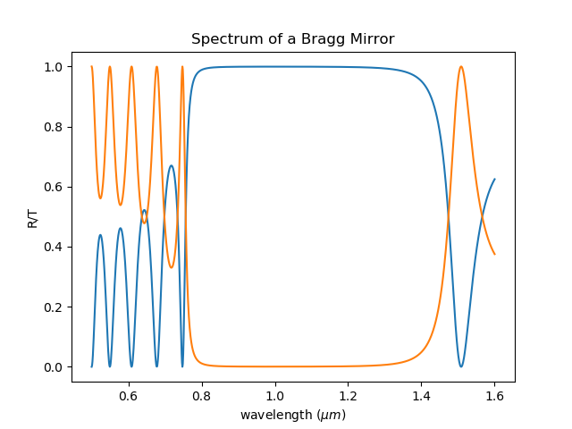
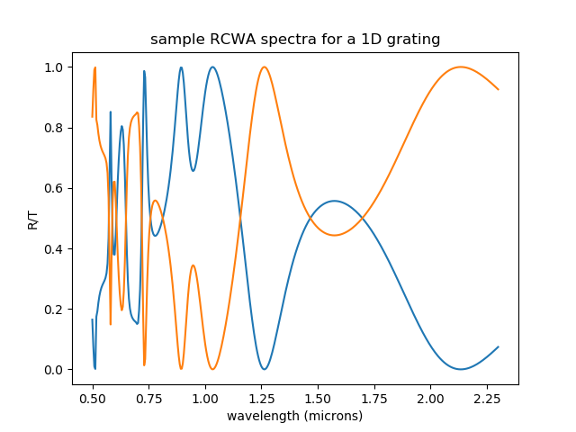

# Python Rigorous-Coupled-Wave-Analysis PACKAGE
A collection of extremely inter-related semi-analytic fourier series solutions for Maxwell's equations written in python.
This package actually contains three different methods:
1) TMM: classical transfer matrix method applicable for analyzing the propagation of light through uniform, finite thickness layers
2) Plane Wave Expansion Method: essentially solves Maxwell's equations in k-space.
3) RCWA: a synthesis of TMM and PWEM to analyze the transmission of light through layered structures with periodic patterning

The organization of the package is centered around modules which can run a simulation for each of the three methods, given the correct inputs from the user. 

Please refer to the wiki for detailed information about the status of various functionalities

## Prerequisites and Installation
Make sure you have a functional version of python 3 with numpy, scipy, and matplotlib. (Python 3 is required because we use the @ symbol for matrix multiplication)
Simply clone the package into your local directory and you should be ready to go.

## USAGE
Right now, the package is partitioned by the type of numerical method used. Examples for each method are in the folder "method_name"_examples. These examples should give you a sense of how to use the simulation functions

# Examples
We show a few exemplary examples from each method to illustrate its functionality
## First TMM
TMM is usually the 'intellectual' precursor to RCWA. It assumes different layers but each layer has no structure (could be anisotropic however)
A simple demonstration of TMM can be done by reproducing the spectrum of a Bragg grating.

### run_TMM function

## PWEM
Plane wave expansion method is simply the solution of Maxwell's equations in Fourier space.

## Transitioning to RCWA
RCWA is a synthesis of TMM and PWEM in that it targets layered structures whereby each layer contains some sort of periodic pattern

## Authors
Nathan Zhao
